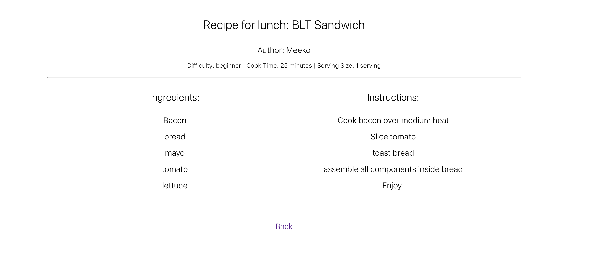

#Application Title: MyCookbook App

Link to live applicato: https://my-cookbook-app.maplantz89.now.sh/

##Screenshots of myCookbook App

#Summary of Application
This cookbook application allows users to search, create and organize recipes into multiple cookbooks. This will make organization for home cooks expontentially better. 

Future Ideas:
1. This application also has sights for catering to restaurants who rotate through different cookbooks/menus. 
2. Allow rating of recipes/cookbook 

#Technology used: 
React 
HTML
JavaScript
Node.js
PostgresSQL
Express
CSS